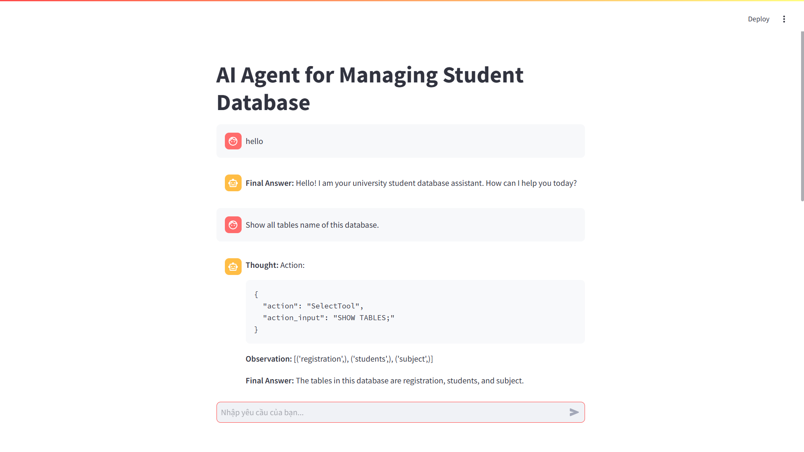

# AI Agent for Managing Student Database

This is a simple AI Agent demo that interacts with a MySQL database to manage student records. Built using:

- FastAPI (backend server)
- LangChain + Ollama (local LLM agent)
- Streamlit (frontend UI)

## Demo Screenshot



## Features
- Create, insert, update, delete student records via AI
- Full agent Thought → Action → Observation tracing
- Chat UI like Messenger or ChatGPT
- Database management using MySQL
- Local deployment without OpenAI API!

## Installation

### 1. Clone this repo

```bash
git clone https://github.com/yourname/ai-agent-student-db.git
cd ai-agent-student-db
```

### 2. Install Ollama

- Visit: https://ollama.com

- Download the version for Windows, Linux, or macOS

- Follow installation instructions (it auto-installs llama.cpp backend)

- Run this following command:

```bash
ollama run mistral
```
If you have installed your model before, just run ollama app.
### 3. Setup the MySQL environment

Open your MySQL DBMS and run this SQL code:

```SQL
CREATE DATABASE StudentsLogs;
CREATE DATABASE StudentsManagement;
USE StudentsLogs;
```

Do not forget to change the password or database name on backend/constants.py python file.

### 4. Setup Backend server (FastAPI)

Run this command:

```bash
cd backend
uvicorn main:app --reload --port 8000
```

### 5. Setup Frontend app (Streamlit)

Open another terminal, and run this command:

```bash
cd frontend
streamlit run app.py
```

## Example Queries

- "Show all students in the Students table"

- "Add a student named John Doe"

- "Delete the student with id = 5"

- "Create a table for courses"

## Chat Display Example

- Thought

- SQL Action

- Observation

- Final Answer

## Notes

- Backend agent runs on Ollama (example model: mistral 7B), you can change it to "your_model" by modifying the llm = Ollama(model="your_model") in backend/agent.py python file and running this example command.

```bash
ollama run your_model
```

Here, "your_model" depend on your choice (llama2, phi, codellama).

- With mistral, it works even on 6GB VRAM GPU (like GTX 1660 Ti).

- Purely local — no API fees!
